# FuMonoStudios (Mail to atlantis)

- [FuMonoStudios (Mail to atlantis)](#fumonostudios-mail-to-atlantis)
  - [Ficha Técnica](#ficha-técnica)
  - [Mecanicas](#mecanicas)
    - [Movimiento en la exploracion](#movimiento-en-la-exploracion)
    - [Dialogos con los NPC](#dialogos-con-los-npc)
    - [Gestión de paquetes](#gestión-de-paquetes)
      - [Direcciones](#direcciones)
        - [Manual de trabajo](#manual-de-trabajo)
      - [Etiquetado por barrio](#etiquetado-por-barrio)
      - [Sello de tipo de paquete](#sello-de-tipo-de-paquete)
      - [Pesado](#pesado)
      - [Envoltura](#envoltura)
      - [Cálculo del dinero al final de la jornada](#cálculo-del-dinero-al-final-de-la-jornada)
    - [Calculo de Finales y Felicidad](#calculo-de-finales-y-felicidad)
      - [Finales](#finales)
      - [NPCs especiales](#npcs-especiales)
      - [Mejoras de los NPC](#mejoras-de-los-npc)
      - [Hablar con personajes](#hablar-con-personajes)
      - [Funcionamiento de eventos/sidequest de los NPC](#funcionamiento-de-eventossidequest-de-los-npc)
  - [Diseño](#diseño)
    - [Fase de exploracion](#fase-de-exploracion)
    - [Fase de gestión de paquetes](#fase-de-gestión-de-paquetes)
    - [Fase de dinero](#fase-de-dinero)
  - [Arte](#arte)
    - [Paletas de color](#paletas-de-color)
    - [Lugares](#lugares)
      - [Oficina de trabajo](#oficina-de-trabajo)
      - [Distritos](#distritos)
  - [Narrativa](#narrativa)
    - [Narrativa de Atlantis](#narrativa-de-atlantis)
      - [Funcionamiento interno de la Atlantida](#funcionamiento-interno-de-la-atlantida)
    - [Personajes](#personajes)
      - [Protagonista](#protagonista)
      - [Jefe oficina](#jefe-oficina)
    - [NPC Grandes](#npc-grandes)
      - [Vagabundo](#vagabundo)
        - [Finales](#finales-1)
      - [Secretario del rey](#secretario-del-rey)
        - [Finales](#finales-2)
    - [NPC Menores](#npc-menores)
      - [Campesino](#campesino)
      - [Artesano](#artesano)
      - [Tarotisa](#tarotisa)
      - [Soldado](#soldado)
      - [Contable](#contable)

---

## Ficha Técnica
|Genero|Publico Objetivo|
|--|---|
|Simulación|Jugadores interesados en la narrativa|

[UML](https://lucid.app/lucidchart/29f6e8d3-db3a-4b3c-98d9-a0ec94f8a0d4/edit?view_items=jGC~qOX6U6pG&invitationId=inv_555ab00b-17ce-4af3-80db-82f253f680ba)

---

## Mecanicas

### Movimiento en la exploracion
Para explorar la Atlántida se mostrarán imágenes de los distritos donde podrá seleccionar hacia donde ir clicando en las direcciones de las calles, estilo *Profesor Layton*. Cada vez que se clickea una flecha se cambia de un distrito a otro. En cada distrito siempre habrá un **NPC** con el cual se podra hablar. Este podra dejarte **encargos** en algunas ocasiones mientras que te contara un poco de su vida en otras. No es podible acceder a todos los distritos desde todos los distritos, estando conectados: todos los distritos en un mismo anillo, los distritos de Demeter y Hefesto con el de Hermes y el distrito de Apolo con el de Poseidón. Según pasen los días se iran desbloqueando el acceso a los distintos anillos, pudiendo al principio solo acceder a los **exteriores**, y a partir del quinto día se podrá acceder al **interior** y al **castillo real**. En el mapa también será posible clickear en elementos de los distritos para recibir información extra del lugar.

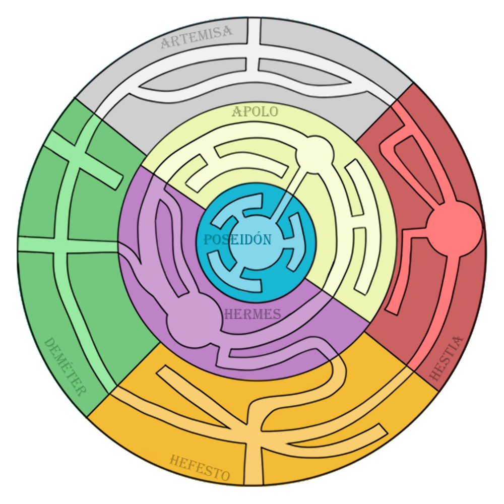

### Dialogos con los NPC
Al hacer clic sobre un NPC mientras se está en la fase de exploración se mostrará en pantalla un cuadro de diálogo con lo que te dice dicho NPC, dicho dialogo puede ser tanto un encargo de correo como simplemente algo de información sobre la historia de ese NPC y su entorno. Si un jugador vuelve a hablar con el NPC aparecera un dialogo predeterminado con el cual el jugador en el que le indicara que deje de molestarlo o que esta ocupado, cortando asi la conversación. 

En total hay 6 tipos de dialogos: 
 - Dialogo de presentación que le dirán al jugador la primera vez que hablen con ellos. 
 - Dialogos de contexto, los cuales varían según el nivel de felicidad de los NPC y estos sirven tanto para informarte de la situación personal del NPC como su entorno. 
 - Dialogos de favores en donde le explicaran los NPC al jugador una adversidad y le pediran su ayuda mediante la desviación del correo. 
 - Dialogo Maxifeliz el cual te dice el NPC una vez alcanzas la felicidad máxima con él, haciendote entrega de un regalo con ello. 
 - Dialogo de perdida, que es un dialogo que aparece cuando haces totalmente infeliz al NPC, lo que supone en una perdida completa de la progresión de este. 

### Gestión de paquetes

La fase de gestión de **paquetes** consta de varias mecánicas que se irán aplicando de forma incremental (añadiendose a las mecánicas anteriores) cada ciertas *jornadas* (por determinar).

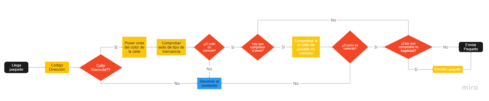

Al envíar un paquete de forma incorrecta el jugador recibirá una **amonestación** lo que provoca que se le reste dinero al final de la *jornada*, incluso pudiendo acabar una jornada habiendo perdido más dinero que ganado.

#### Direcciones
Cada paquete tendrá un bloque de texto donde se podrá leer: **nombre**, **cógido postal** y **calle**.

El jugador deberá comprobar que el **código postal** y la calle son validos. Esto es que el **código postal** exista y que la **calle** pertenezca al distrito al que va asociado el **código postal**. Para comprobar estas cosas el jugador cuenta con un **manual de trabajo** donde están enlistados los distritos con sus calles.

|Codigo|Distrito|Calles|
|---|---|---|
|001|Hestia|"Avenida del Besugo real" "Calle Medusa la santa" "Calle Gambon III"|
|010|Artemisa|"Avenida Mantarraya" "Calle de la ballena tiburona" "Calle Rodaballo"|
|011|Demeter|"Gran ruta de las algas"  "Camino del calamar"  "Camino de la morena"|
|100|Hefesto|"Calle Caballito de tierra" "Calle Lubina, La Sabia" "Calle de la trucha dorada"|
|101|Hermes|"Gran Avenida del Arrecife" "Calle del Coral" "Calle Boqueronio XXVIII"|
|110|Apolo|"Calle Ajolote" "Calle Arlequin" "Avenida del Anfiteatro"|
|111|Poseidon|"Calle de los nobles" "Calle del trono" "Calle de los Jardines"|

##### Manual de trabajo
El jugador contará con una libreta que podrá abrir (situada en la zona inferior derecha). En esta se podrán ver distintas páginas que explicarán en cada una de ellas las mecánicas sobre los paquetes que el jugador tenga disponibles. Por tanto debe haber las siguientes páginas al final de juego:
 - [Introduccion e indice]
 - [Direcciones y sellos de colores](#direcciones)
 - [Sellos](#sello-de-tipo-de-paquete)
 - [Pesos](#pesado)
 - [Explicación de envoltura](#envoltura)

|Ejemplos|a|
|-|-|
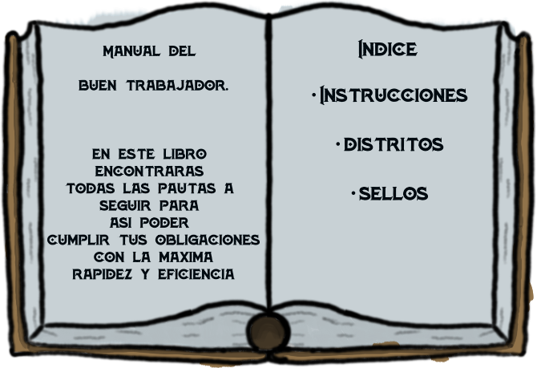 |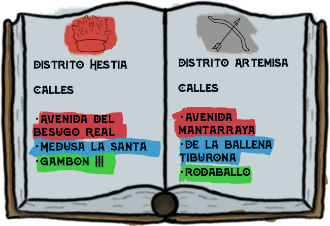 |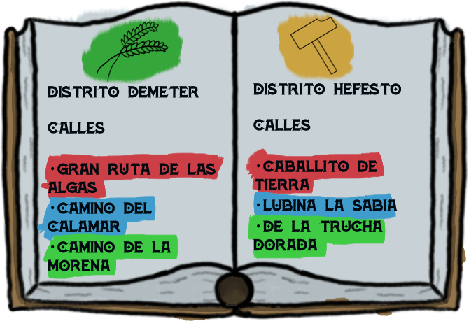 |
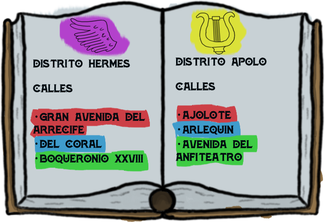 |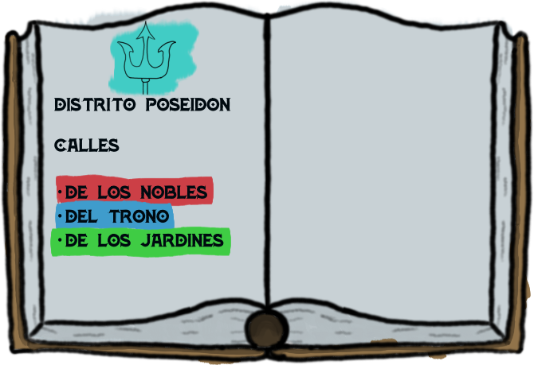 |
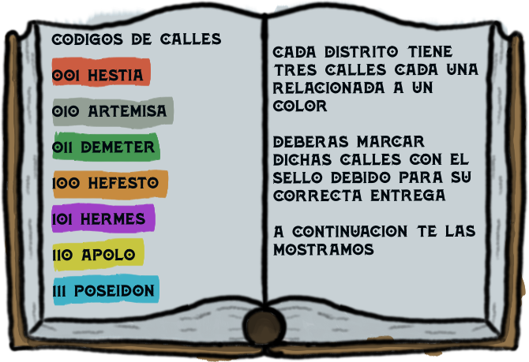 |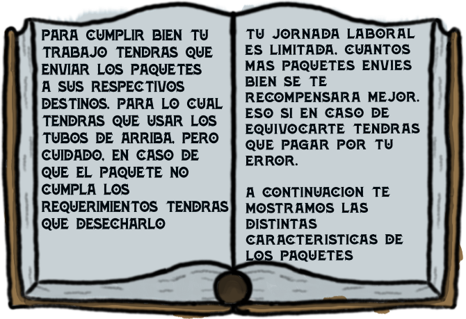 |
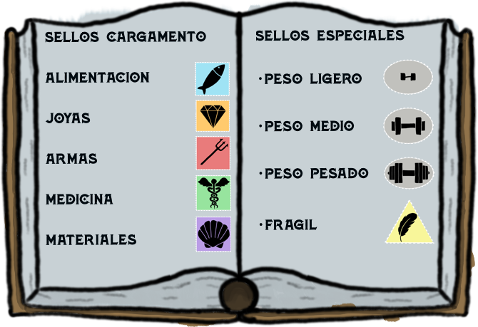|
#### Etiquetado por barrio
En el caso de que la **dirección** sea correcta el jugador deberá emplear un sello del color correspondiente a la calle (ver en el **manual de trabajo**). Poner el color incorrecto o envíar el paquete teniendo la dirección incorrecta conllevará a una **amonestación**

#### Sello de tipo de paquete
Llegado cierto punto se exigirá al jugador detectar la falsificación de **sellos**. En el **manual de trabajo** se podra ver los **sellos** autenticos y el cargamento que marcan estos.

Existen 5 tipos de sellos:
|Alimento|Medicinas|Joyas|Materiales|Armamento
|-|-|-|-|-|
||||||

Enviar un paquete con un **sello** falso implica una **amonestación**. Hay un total de 3 **sellos falsos** por cada tipo.

#### Pesado
Un paquete con un **sello de pesado** deberá ser pesado y comprobado respecto a el peso que le asigna el **sello** por tanto un paquete con este **sello** solo debe ser enviado si su **peso** medido en la **balanza** coincide con las métricas que indica el **sello** (referirse al **manual de trabajo**). Una vez presentada esta mecánica aparecerá una balanza en la oficina de trabajao donde se podrán pesar los **paquetes** colocándolos encima de estos. Al colocar los **paquetes** una flecha comenzara a moverse en una región, lo que indicara el peso del **paquete** una vez se pare.

#### Envoltura

Un paquete con un **sello de frágil** deberá ser envuelto con **cinta de embalaje**. Cada paquete tendra una ruta de embalaje diferente, siendo estos los distintos puntos ordenados por los que debe pasar la cinta para que el embalado sea correcto. Los patrones de cada **paquete** serán reflejados por medio de puntos y rectas en el paquete una vez tomada la **cinta**. Enviar un **paquete frágil** sin embalar supone una **amonestación**. De primeras, solo podra ser posible usar la **cinta** con los **paquetes** con sello de envoltura.

#### Cálculo del dinero al final de la jornada
Al final de la jornada se abonará al jugador cierta cantidad de dinero siguiendo el siguiente cálculo

> Envíos correctos * 20 - Envíos Erroneos * 30

Tras saber cuanto recibe el jugador se le quitará lo correspondiente para pagar el alquier. Si el jugador se queda sin dinero implica fin de partida, saliendo el final de deportado y sin la posibilidad de saber cual son el resto de finales de los NPC.

#### Fallo envío paquete
Cada vez que el jugador falle en el envio de un **paquete**, aparece un **ticket** que le dice el fallo cometido y la sanción puesta por este.

### Calculo de Finales y Felicidad

#### Felicidad
Cada personaje tiene asociado un parámetro de felicidad, dicho valor va aumentando o reduciendose. 

La felicidad puede ir desde el -X hasta el Y, teniendo diferentes puntos que actuan como flags.

Tras el día final se pasará a una escena donde se irá exponiendo en un texto / imagen donde se vea el final del NPC en función de la felicidad con la que acaba. En el caso de felicidad mínima no se mostrará el final del personaje.

Condiciones del comportamiento de la felicidad:

- Envío de lo que ha pedido un NPC (+5 felicidad)
- Envío extraviado de lo que ha pedido un NPC (-5 felicidad)
- Si se reduce la felicidad al máximo de un NPC, da igual lo que se haga que esta ya no podrá volver a subir. 
- Si no se supera cierto umbral, el NPC tendra un final malo, si se llega más o menos a un tercio de la barra el NPC tendra un final neutral, si se llega a dos tercios de la barra, el NPC tendra un final bueno y si se consigue llenar toda la barra el NPC tendra un final Maxi Feliz, el cual implique recibir una mejora de dicho NPC que facilita otra de las mecánicas del juego. 

#### Finales
Este comprobación del nivel de barras se hace al final de los 14 días de trabajo, en donde se analizarán y se iran poniendo los distintos finales de cada NPC mediante un texto. 

#### NPCs especiales
A parte de esto hay dos NPC especiales los cuales son el vagabundo y el secretario real. Al ayudar a uno de estos si o si se reduce la felicidad de los otros siempre que sea mediante paquetes extraviados. Al llegar a la maxifelicidad de uno de ellos el día 14 incluira un evento extra en el que el jugador deberá cumplir ciertos mandados para desbloquear su verdadero final, el cual afectara a toda la Atlantida y no solo a esos personajes personalmente. Si no se cumple el mandado saldra el final bueno por defecto. 
Además las misiones siguen una historia lineal que es la principal historia del juego, de manera que si haces la misión del día 1, la del día 3 la ignoras y el día 5 si que hablas con él, tendrás la misión correspondiente al día 3 en vez del día 5, y en el día 6 tendrás la del día 4 y así. Es decir, que debes hacer misiones todos los días o el juego cortará la historia a la mitad ya que sí o sí al acabar el día 14 se acaba el juego ya que te pillan y eres deportado.
Esto hará que si ignoras por mucho tiempo a los NPC no podrás rellenar por completo su barra de felicidad, así que es importante cumplir misiones todos los días.

#### Mejoras de los NPC
Los NPCs te entregaran un regalo que te hará la labor más fácil en el trabajo. Estos regalos una vez recibidos ya no se pueden perder, siendo una mejora permanente para el jugador, aunque si es posible que la felicidad del NPC reduzca después de eso. Cabe recalcar que las mejoras del secretario y el vagabundo se obtienen en el día 7 si se llega a x felicidad, siendo esta menor a la maxifeliz. Estas mejoras son:

- **Vagabundo**: te da un sello multicolor que se puede poner a los paquetes y vale para todas las calles
- **Tarotisa**: te entrega una bola de cristal que tiene 1/x posibilidad de lanzar un brillo cuando el paquete actual es erroneo
- **Artesano**: te permite envolver rapidamente un paquete con una cinta especial
- **Campesino**: te dará una balanza digital que te dice el peso directamente
- **Contable**: hace que los paquetes bien entregados te den 10 de dinero extra por cada paquete que envíes correctamente
- **Soldado**: te permite equivocarte con 2 paquetes antes de que se te aplique una penalización
- **Secretario real**: te pone marcadores en el manual que te permiten saltar a páginas clave del manual.

#### Hablar con personajes
Al hacer click sobre un NPC durante la **fase de exploración**, se abrirá una pantalla donde el NPC hablará con el jugador diciendo sus lineas de diálogo. El jugador con un primer click podrá hacer que aparezca todo el texto sin la animacion de que se escriba poco a poco y con un click posterior aparece el siguente dialogo. Con el último dialogo se cierra la conversación.

Si el jugador vuelve a hablar con un NPC este repetirá su dialogo para que el jugador pueda tomar nota si se le escapó algo de lo que dijo.

#### Funcionamiento de eventos/sidequest de los NPC
Cada NPC tendrá misiones que asignar al jugador. En estas misiones habrá una condicion concreta que tendrá que cumplir sobre un tipo de paquetes que va en contra de lo legal, por lo que será amonestado por ella, por lo que el jugador debe controlar cuanto quiere ayudar a los NPC mientras mantiene un nivel de dinero alto.
Estos eventos pueden ir desde dejar pasar un paquete especial con el nombre del NPC hasta desviar paquetes a donde el NPC te diga.

La felicidad de los NPC subirá cada vez que cumples un evento, y necesitarás cumplir los 5 eventos distintos para conseguir su maxifinal, no obstante, si consigues su felicidad a 90 te dará su mejora. La forma en la que sube y baja la felicidad no es lineal, habiendo misiones que recompensen o penalicen más que otras.

Cada evento saldrá solo una vez.

Los **paquetes de eventos** se deben definir de antemano en un JSON, de forma que los **paquetes de eventos** nunca sean random.

Ejemplos tipicos de eventos:

- NPC te pide que trates su paquete de una forma especial: ignorar una de las mecanicas como el peso, enviar a un sitio incorrecto, desecharlo aunque este bien...
- NPC te pide enviar x paquetes de un tipo a otro distinto a pesar de que estos sean correctos de su ubicacion normal. Todos los paquetes añadidos a la pool de esta condicion serán correctos para que no sean desechados.

---

## Diseño
El juego constará de varias jornadas (14) donde el jugador tendrá que ir manteniendo su vida en Atlantis pagando el alquiler al final de varias jornadas y aprendiendo sobre sus habitantes. Cada jornada constará de dos fases:

### Fase de exploracion

En esta fase el jugador podra recorrer el mapa en primera persona moviendose por los distintos distritos de la Atlántida. En cada distrito podrá encontrar a un NPC específico del distrito el cual le contará algo de su historia o le pedira un favor relacionado con el correo. En un principio los barrios de los anillos más interiores estarán bloqueados pero a partir del día 5 estos estarán libres.

### Fase de gestión de paquetes

Durante la fase de gestíon el jugador deberá comprobar la validez de los **paquetes** esto llevará a distintos minijuegos que se irán añadiendo con el transcurso de los días. Cada nueva capa añadida le irá obligando a estar más atento a los detalles en cada paquete.

#### Amonestaciones
Cada vez que el jugador cometa un fallo se le aplicara una penalización y aparecerá una nota con el tipo de fallo la cual puede ser tirada a la basura. Una vez penalizado, el **ingreso** del día del jugador se restará por una cantidad fija de dinero multiplicado por el número de fallos cometidos.

#### Condiciones especiales del jefe Oficina
Cada tres días comenzando por el día 2 el **jefe** de la oficina comentará un problema en el lugar de trabajo lo que provocará un cambio en la dinámica normal de la fase de gestión. Estos cambios iran desde mezclar tubos hasta invertir los sellos de pesado, simepre cosas que confundan al **jugador** pero que no impidan usar alguna de las mecánicas ya desbloqueadas.

Ejemplos de condiciones:

- **Confusión entre tubos**: los paquetes dirigidos a un distrito van a otro y los del otro al uno. O que los de un distrito deben enviarse por otro distinto. Algunos tubos pueden incluso estar bloqueados, y la papelera también puede verse afectada.

- **Confusion entre pesos**: los tipos de peso intercambian significado, es decir, que algo de peso pequeño se considera de mucho peso y algo de mucho peso de peso pequeño...

- **Restringir según el tipo de sello los distritos a los que pueden ir los paquetes**: Los paquetes de armas no pueden ir a Demeter, por ejemplo.

- **Restringir según el tipo del sello el peso que puede tener un paquete**: los paquetes de armas no pueden exceder el peso medio por ejemplo.

#### Paquetes especiales de NPC
Los NPC podrán **asignar eventos** que spawneen paquetes especiales a lo largo de la jornada. Estos paquetes compondrán una lista que poco a poco irán saliendo intentando salir todos antes de acabar el tiempo. Si el jugador promedio consiguiese 15 paquetes en ese día se enseñarán todos los paquetes de evento hasta antes del paquete 10. Estos paquetes serán completamente idénticos a los que pueden salir en ese día, salvo las cualidades especiales que lleve el evento.
Por ejemplo, la medium pide que los paquetes de medicina que van hacia el distrito hestia vayan hacia el distrito de demeter, y en total serán 3.
Estos paquetes serán identicos al resto, es decir, si en ese día se ha desbloqueado el sello de pesaje, estos paquetes podrán llevar el sello de pesaje y así. Es de notar que serán correctos, osea que no tendrán nada ilegal ni fuera de lugar, lo único que cambiará será las características del evento, en el caso del medium, será que mandará medicinas y irá a Hestia.
Si queda **1 minuto de juego**, los paquetes que falten por salir **saldrán 100%** para evitar penalizar a jugadores muy lentos.
Si *se mandan a donde deben ir*, **no penalizarán**, pero **harán infeliz** al NPC, sin embargo *si hacemos lo que pidió el evento*, **penalizará** y el **NPC será feliz**.

Estos eventos pueden ser sobre todo tipo de características de los paquetes, *no dejar pasar paquetes de un nombre*, *redirigir paquetes de medicina de un distrito a otro*, *descartar paquetes que pesen X*, *tirar todos los paquetes de una calle*, etc...

La probabilidad de que salga un paquete especial es de 70% al inicio de la partida, cada vez que pasa 1/4 de tiempo de partida se suma un 10% a dicha probabilidad resultando en el último cuarto de partida (62 segundos) en un 100% de probabilidad.

### Fase de dinero

Una vez terminado la fase de trabajo, saldrá una pantalla con texto que explique el número de aciertos, el número de fallos, el gasto del alquiler, el dinero obtenido ese día y el dinero con el que acaba el jugador el día.
- ((ahorros - alquiler) + aciertos * 20 - fallos * 30) en condiciones normales.

En caso de quedarte sin dinero, saldrá el game over de quedarse sin dinero (te deportan de Atlantis). Dicho game over no te reinicia la partida, pudiendo acceder al inicio del día en el que te deportaron desde el menú inicial.

## Arte
Al irnos moviendo por los diferentes distritos, lo haremos a través de diferentes pantallas con fondos estáticos en primera persona. Los fondos tendrán un estilo artístico simple inspirado e juegos como profesor Layton, con una paleta de colores sencilla estilo acuarela donde los objetos lejanos tendrán menos detalle o estarán más difuminados mientras que los objetos mas cercanos tendrán mas detalle, aunque como es una paleta de colores tirando a acuarela a veces los colores se pueden salir de las líneas como pasa en la película de 101 Dalmatas de Disney (la animación antigua, no el remake live action). 

En los escenarios de exploración encontraremos algunos personajes con los que poder interactuar teniendo una forma física en su diseño inspirada en juegos como profesor Layton por su estilo caricaturesco. Su diseño mezcla su personalidad con el pescado que sea más capaz de resaltarla. Por ejemplo el pez globo se le da al contable al ser una persona timida y que vive en continuo estrés. O la tarotisa es un pez abisal debido a la posibilidad de usar su linterna como bola de cristal, unido a que le aporta el aspecto de tener mucha edad.

También habra decorado con el que pueda interactuar el jugador para asi recibir información extra de la atlantida. Dicha decoración no estara resaltada y se acomodará con el fondo ya que es una recompensa para los jugadores más curiosos.

La parte estética de los escenarios se basará en una arquitectura griega antigua, teniendo como referencia a juegos como Assassin's Creed Odyssey.

### Paletas de color
Los fondos de la ciudad de la Atlántida tendrán una paleta de colores similar de grises y blancos, con un color extra predominante único de cada distrito: En el distrito de Démeter será el verde, en el de Hefesto el naranja, en el de Hestia el rojo, en el de Artemisa el gris, en el de Hermes el morado, en el de Apolo el amarillo y en el de Poseidón el azul.

### Progresion de dias

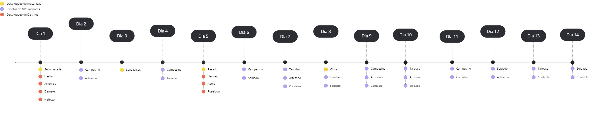

Durante los 14 días de juego se podrá:
- Desbloquear una nueva mecánica (amarillo).
- Desbloquear un nuevi distrito (rojo).
- Obtener una misión de un NPC (azul).

### Lugares

#### Oficina de trabajo
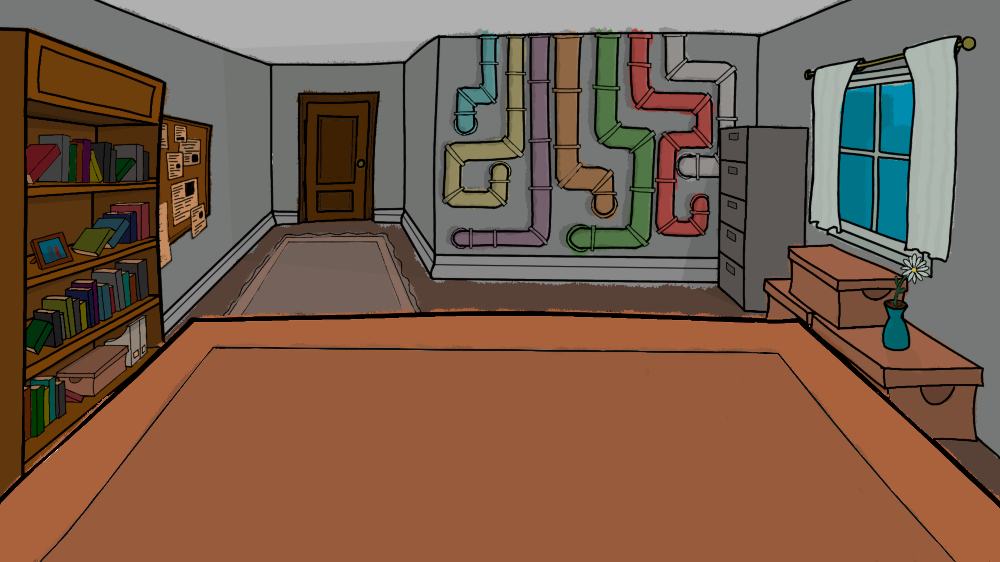
Tubos donde se envían los paquetes
|a|b|c|d|e|f|g|
|-|-|-|-|-|-|-|
|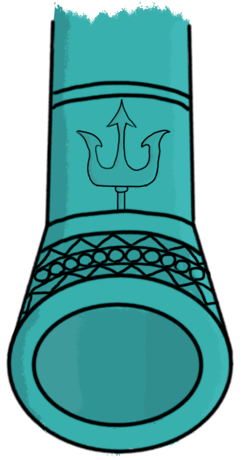| 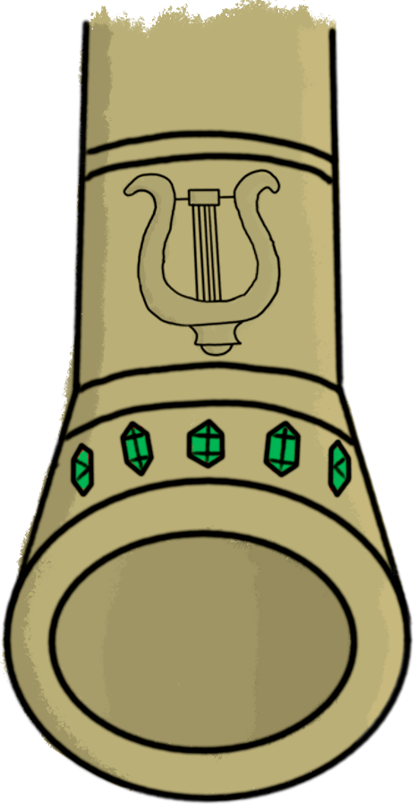 |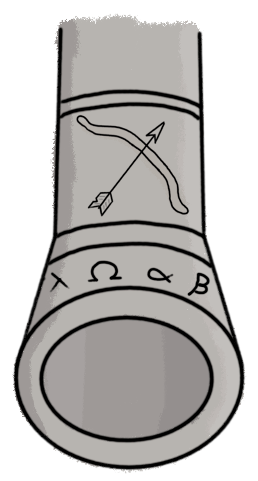| 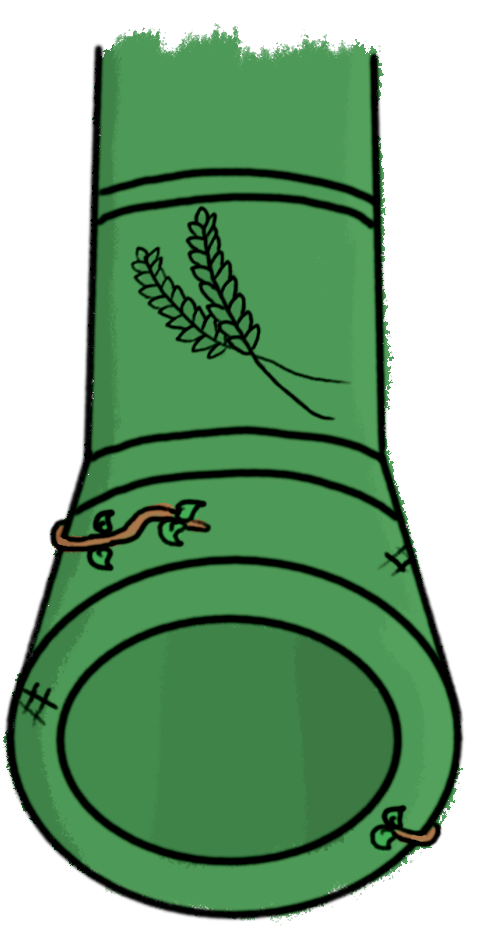| 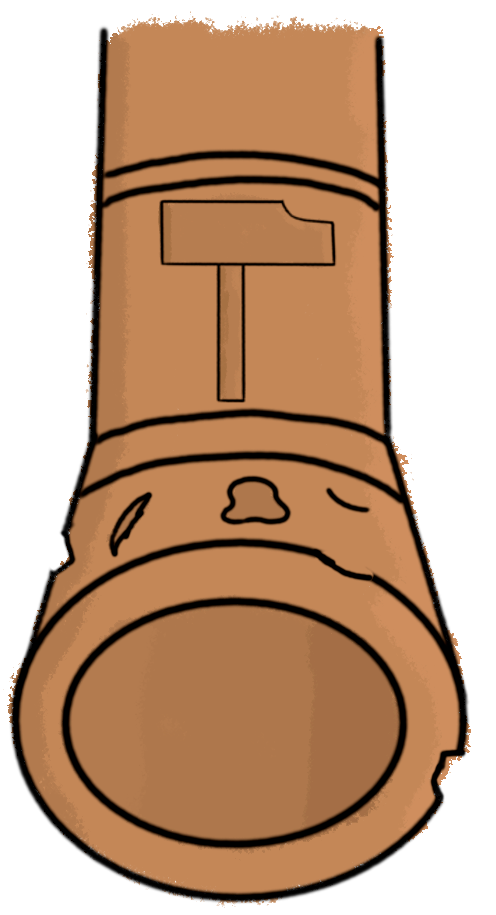| 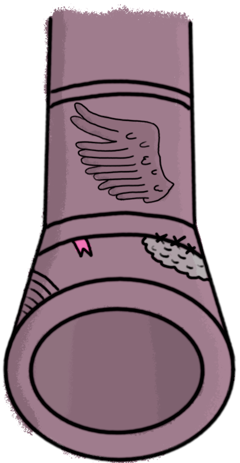 |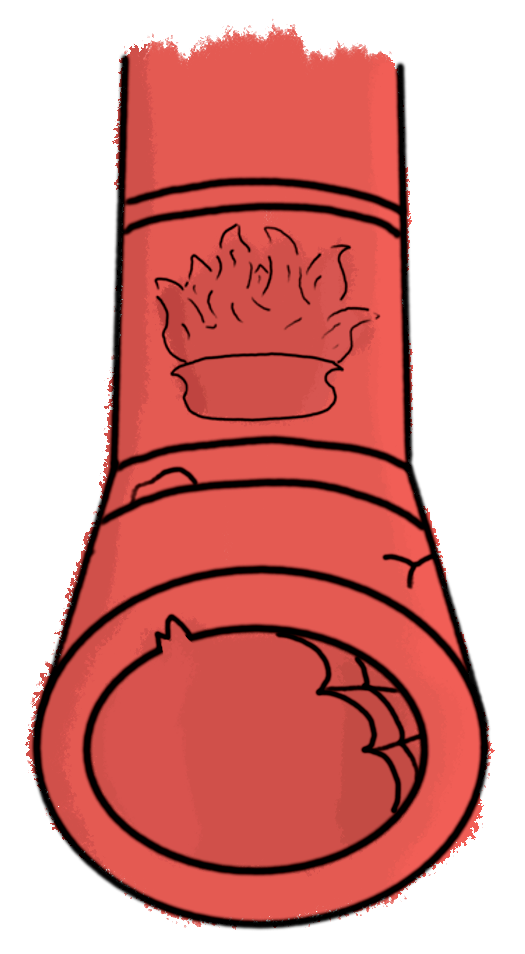|
#### Distritos

---

## Narrativa

### Narrativa de Atlantis
Hace miles de años, el mundo era capaz espectador del punto máximo de una de las ciudades más avanzadas que jamas hayan existido, la Atlantida. Este pueblo griego del mediterraneo se destacaba por su gran tecnologia, bajo la cual sus habitantes prosperaban y vivian en paz. Sin embargo, esto provoco un sentimiento de soberbia absoluta en ellos, los cuales renegaron de los dioses que durante años habian venerado al sentir que ya no los necesitaban. Esto provoco la ira del Olimpo, en especial de poseidón, por lo que en un arrebato de rabia decidió echar tres maldiciones a los habitantes. La primera fue invocar un terremoto que acabaría hundiendo la civilización en el oceano. La segunda fue convertir a sus habitantes en diferentes amalgamas al ponerles características de seres marinos. Por último hizo que cada nueva generación de la ciudad fuera más ignorante que la anterior, provocando que toda la tecnología con la que alguna vez contaron se perdiera en el olvido. Afortunadamente antes de que la ciudad se hundiera del todo, los atlantes diseñaron y construyeron una cúpula la cual les protegiera del agua, de la presión de la profundidad y filtrase oxigeno del propio agua. Al final tras muchos años y generaciones, los atlantes lograron adaptarse a la vida oceanica, pero al mismo tiempo, olvidando todo lo que alguna vez sabian, incluyendo la existencia de los humanos a los cuales veían como un simple mito.

#### Funcionamiento interno de la Atlantida
La Atlantida es una monarquía centralista, en la cual hay una gran división entre las diferentes clases sociales. La ciudad esta compuesta por varios distritos divididos por muros, teniendo una forma de anillos. En cada distrito reside una clase social u oficio diferente. En los cuatro distritos exteriores que conforman el primer anillo se encuentran: los campesinos (Distrito de Demeter), los artesanos (Distrito de Hefesto), los boticarios y adivinos (Distrito de Artemisa) y los desechos sociales (Distrito de Hestia). Después en el segundo anillo más al interior podemos encontrar dos distritos, el de los comerciantes (Distrito de Hermes) y el de los nobles (Distrito de Apolo). Por último en el centro de la ciudad se encuentra el castillo real, donde reside la monarquia y los diferentes criados que la atienden.

### Personajes

#### Protagonista
En el juego encarnamos a Paco Jones, un aventurero español de 35 años que tras innumerables fracasos acabo sus días trabajando en correos. Sin embargo, uno de sus monotonos dias de trabajo recibe una botella de cristal que en su interior tenía una gran revelación. Este lee que la carta viene de la Atlantida, por parte de un grupo que se hace llamar las lechuzas. Este, si bien al principio se muestra excéptico, acaba convenciendose gracias a una imagen en la que se ve un lugar rodeado de una cúpula con muchos hombres pez. Decidido a retomar su carrera como aventurero, decide guardarse la información para si mismo e intentar explorar esta maravillosa ciudad. Para lograr llegar a ella pide prestado un submarino bajo la promesa de devolverlo junto a una gran suma de dinero. También gasta sus ahorros para construirse un disfraz de pescado, para poder camuflarse entre los atlantes, ya que no sabía si estos serían hostiles o no. Tras un largo viaje logra llegar a la gran Atlántida, en donde, tras explorar un poco sus calles se encuentra con un pez gota el cual buscaba un nuevo trabajador para su empresa. Dicho trabajo consistía en la gestión de correo de la Atlántida. Aunque de primeras esto no le convence, decide tomarlo para recaudar información y dinero para sobrevivir. Es así como inicía su gran aventura en Atlantis.

#### Jefe oficina
El jefe dirige la oficina de correos y es el encargado de comprobar que todo vaya bien por la oficina y que trabajes acorde a las cuotas. 
Lo conoces en la puerta de la oficina, cabreado con su exempleado que salió corriendo dejando su trabajo. Será estricto contigo ya que últimamente no ha tenido buenas experiencias con sus trabajadores.
El jefe de oficina será encargado de pagarte cuando acabas los días, así como amonestarte si cometes infracciones.
De normal no te lo encontrarás en la fase de exploración salvo en los días 1 y 5 que te explicará algo. También lo veras en la oficina cada vez que haya una condición especial ese día. Por último en los días que haya tutorial se encontrará detras de Paco narrando y observando que aprenda bien lo que tiene que hacer, razón por la cual no aparecerá en dichas escenas.

### NPC Grandes

#### Vagabundo

Anemos Tokugawa es actualmente un vagabundo que pasa sus días bebiendo con el poco oricalco del que dispone en los barrios más bajos de Atlántida, aunque no siempre fue así. En su momento Anemos fue el verdadero heredero del trono de la Atlántida, por lo tanto es uno de los pocos habitantes de la misma que poseen cierto conocimiento sobre los humanos, este conocimiento se fue pasando generación a generación entre los herederos al trono de la Atlántida. Sin embargo, antes de que pudiera conocer toda la verdad sobre los humanos y su historia, su padre, el cual le estaba instruyendo en dichos conocimientos, fue asesinado por el secretario real mediante veneno. Todo esto paso ante la atenta mirada de Anemos, el cual rapidamente fue amenazado y drogado por el secretario real. 
Cómo se llevó a cabo la traición: El secretario real obtuvo veneno de pez globo del mismísimo padre de Glover Globus a cambio de ser este mismo el que manejara todo el comercio atlante.
Estuvo malviviendo en las calles del distrito de Hestia mendigando, rebuscando los cubos de basura y robando en los otros distritos, lo cual le permitió tener una visión más amplia de las injusticias sufridas por cada distrito del reino.
En la actualidad toda la información sobre los humanos y su propio destino como rey le es indiferente y se encuentra en un penoso estado maldiciendo su miserable vida.
Actúa de forma amigable y de colegueo con el protagonista, y de forma filosófica y fuerte cuando habla sobre su situación con el secretario del rey.
Anemos es una carpa koi, la cual se encuentra en un estado de extrema hambruna. este viste con unos ropajes rasgados y holgados que usa para ocultar su lamentable estado. Este oculta su cara con una capucha, asomando únicamente su boca, bigotes y perilla. Este tiene colores vivos a pesar de estos, siendo principalmente el blanco y el rojo.

#### Secretario del rey

Gargafiel Mustaki es un pez gato de tamaño diminuto el cual nació y se crió en el distrito de Hestia. Desde pequeño mostró una gran ambición y una necesidad casi psicótica de controlar todo a su alrededor. Esta obsesión le provocó diferentes problemas en todos los sitios a los que intentaba ir a trabajar, ya que no le gustaba recibir órdenes de nadie. Poco a poco en sus puestos de trabajo sus superiores desaparecen en circunstancias sospechosas pero debido a su extremadamente pequeño tamaño y su habilidad para desviar la atención, nadie sospechaba de él. Fue de esta forma como poco a poco fue escalando posiciones socialmente, pasando de campesino peón a líder de campo, de ahí a aprendiz de artesano para después volverse un maestro de las herramientas, después inició un periodo como pequeño vendedor a la nobleza, hasta que poco a poco se le asignó la venta de productos a su majestad. Una vez conoció a este, utilizó su fina labia para embaucar y que así le diera un cargo dentro del castillo. Poco a poco gracias a sus acertados consejos que le daba al rey, se fue ganando su favor hasta acabar siendo su mano derecha. Sin embargo, un día que investigaba la biblioteca real, se topó con un libro que revelaba la existencia de los humanos y la superficie. Esto le impactó de primeras, lo que en poco tiempo acabó convirtiéndose en una rabia hacia el rey debido a que sentía menosprecio hacia su persona por no revelarle tal noticia, teniendo él que descubrirlo por su cuenta. Es por ello que convencido de la ineptitud del rey decide asesinarlo con la ayuda de un comerciante llamado Glande Globus, el cual accedió darle veneno a cambio de una mejor posición en el distrito de Hermes. Una vez consiguió dicho brebaje envenenó al rey sirviendo una taza con dicha ponzoña. Esto acabó matando al rey, todo ello bajo los ojos de su único heredero, en aquel entonces de 8 años. Gargafiel decido amenazarle y drogarle, dejándole a su suerte en el distrito de Hestia. Por último decidió reinar la Atlántida desde las sombras, ocultando en todo momento el estado del rey bajo la excusa de que le protegía de un atentado terrorista. En cuanto a la información sobre los humanos, decidió guardarla por el momento, para evitar así un estado de histeria colectiva que acabase revelando su horrible delito. 
Actúa de forma cordial y amenazante con el protagonista, también de forma ambiciosa y loca cuando habla de su afán por conocer humanos. Cree que Poseidón creó la especie de los pez-humano como superiores a los seres humanos, y para comprobar si son dignos, les castigó a vivir en las mayores profundidades. Cree que si llegan a la superficie, Poseidón les ayudará a reconquistar el exterior y vivir a sus anchas.

Gargafiel es un pez gato de estatura diminuta, con ojos achinados y un gran y largo bigote. Este tiene una expresión sería y enfadada. Casi siempre se dirige con prepotencia a la gente y viste una larga sotana de tonos azul marinos unida por unos trozos de madera enrollados.

Este es increiblemente astuto y perspicaz, con una capacidad de convencer y manipular casi absurda. Siempre se excusa con sus errores, no siendo capaz de admitir ningun fallo. Suele estar tan metido en sus ideas y planes que a no se que le sirva para uno de ellos, no le dará ninguna importancia a la persona que le hable. Tiene un gran complejo con su tamaño asi que se enfada con todo aquel que lo mencione. Es muy reservado con la mayor parte de la gente, contestando lo más seco posible, midiendo al milimetro sus palabras.

### NPC Menores

#### Campesino

Pancracio Warawa es un campesino que desde pequeño ha carecido de los recursos básicos. Siempre en su mesa ha faltado comida y en su hogar ha faltado calor. A medida que fue creciendo esta situación no mejoraba, lo que le llevó a un profundo estado de depresión que solo se veía mitigado por sus constantes visitas al bar local, donde se emborrachaba hasta perder el conocimiento. Uno de esos días, Pancracio fue rescatado tras una gran borrachera por el grupo de las lechuzas, un grupo secreto el cual, no solo no estaba de acuerdo con el mando del actual rey, sino que además tenían una fé ciega en la existencia de los humanos, viendo a estos como seres superiores y benevolentes que algún día descenderán del cielo para salvar a su gente. Si bien Pancracio era muy escéptico a esto, después de que le mostraran la realidad de la Atlántida, de cómo los comerciantes vendían sus productos a mucho más precio que el que le pagaban a él, o de cómo la mayor parte del ejército hacía de niñeras de los nobles, mientras que la criminalidad aumentaba día tras día en el anillo exterior, todo esto convenció a Pancracio de la veracidad de lo que le contaban. Unido a esto recordó el objeto que guardaba con cariño desde su niñez, un tubo extraño de un material blando pero firme que vio caer del cielo un día. El grupo de las lechuzas al ver dicho artilugio se maravilló del descubrimiento de Pancracio, siendo los primeros en creer su historia. Es en este contexto en donde el campesino conoce al protagonista, siendo ya un miembro totalmente integrado de las lechuzas y con unas ansias de revolución y justicia apenas ocultables. 

Pancracio Warawa es una tortuga marina de mediana edad que viste con una boina, una pajita de plástico que usa como si fuera una pipa y una capa de algas que le sirve como abrigo. Por dentro lleva unos harapos viejos y mugrientos cubiertos de barro. Este tiene una posición encorvada con la cual suele caminar.

Su caracter es amigable y alegre con todos aquellos de los anillos exteriores y muy hostil con todos los de los anillos más interiores. Es un soñador ambicioso muy amoroso con su familia a la cual sin darse cuenta puede llegar a descuidar por su continuo trabajo y su doble vida en el culto de las lechuzas. A pesar de su amabilidad este siempre propones soluciones violentas frente al problema de la diferencia social entre los diferentes distritos.

#### Artesano
 Paulino Tinteiros es un pulpo artesano el cual es capaz de hacer desde vasijas de barro, hasta herramientas de hierro. Sin embargo siempre se ha interesado por las ruinas que se encuentran en la ciudad, viendo en ellas una forma de arte casi divina. Es por ello que siempre intenta hacer creaciones semejantes a dichas obras. Esto provoca que si instructor suela echarle la bronca ya que dedica demasiado tiempo al apartado artístico, cuando para él lo único importante es la utilidad.

 En cuanto a su apariencia, Paulino es un pulpo de 30 años el cual tiene una larga barba de tentáculos y tiene el cuerpo cubierto de pequeñas protuverancias. Este usa 4 tentáculos para sus creaciones y camina sobre otros dos. Este viste un gorro de campesino renacentista (el de Da Vinci) y viste con una túnica negra y un mandil marrón. 
 
 En cuanto a su personalidad, este es orgulloso en cuanto a la calidad de sus creaciones y muy curioso con todo lo que respecta a los humanos. No soporta que le metan prisa cuando hace las cosas y es muy dedicado en todos los ambitos que domina.

#### Tarotisa
Abigail Ampoule es una tarotista la cual tiene la increíble habilidad de consultar el futuro de las personas por medio de las cartas. Si bien esto le sirve para tener un negocio que se sostenga, su afán de dinero la impulsó a hacer un trato con los boticarios de la zona mediante el cual ella predice enfermedades inexistentes a la gente para que estos asistan al boticario a por medicina. Con esta estafa logra engañar a los ingenuos que acaban pisando por su establecimiento. Anteriormente ella no era así, ya que junto a su marido se ganaba la vida honradamente trabajando en el campo. No obstante, después de pasar innumerables penurias debido a la miseria que les pagaban los comerciantes, se le ocurrió comenzar con su negocio de timos junto a los boticarios. Esto provocó la repulsión de su marido que la acabó abandonando.

En cuanto a su apariencia, Abigail es un pez abisal de unos 70 años, la cual en lugar de linterna lleva una bola de cristal que sale directamente de su frente. Esta viste con un pañuelo con adornos de monedas de oricalco que la envuelve la cabeza. También viste con un largo camisón y una especie de capa que la rodea. 

Su caracter es estoico y poco empatico. Se cabrea mucho si no haces algo por ella una vez que te lee la fortuna. Siempre trata de darle la vuelta a todo y se victimiza para generar pena hacia su persona y asi vender más.

#### Soldado

Abakand Istacoz es una langosta con un gran sentido de la justicia, que casi nunca permite que se incumplan las normas por pequeñas que sean. Esto es debido a que en su infancia siempre protegía a los caballitos de mar de los otros niños los cuales los maltrataban. Esto le hizo ganarse más de una paliza, pero le daba igual ya que se sentía realizado, pasando así a tener como meta volverse parte del ejército con el afán de proteger a todos los necesitados de los distritos exteriores. Al contarle esto a su madre, ésta le dijo que al pertenecer a una clase baja, jamás le permitirían ingresar en el ejército, ya que dichos puestos estaban reservados casi exclusivamente para los nobles. Sin embargo tras mucho estudio y esfuerzo logró ingresar y graduarse con honores de la academia militar. Pero grande fue su decepción cuando fue asignado en contra de su voluntad al distrito de apolo, descubriendo en el proceso que la mayor parte de los soldados se asignan en este distrito. Al final acabó frustrado por tener que hacer de niñera de los nobles mientras que en los distritos exteriores como el de Hestia, en donde nació, la criminalidad no deja de aumentar.

En cuanto a su apariencia, Abakand tiene un aspecto desgastado y cansado, sus ojos están decaídos. Su piel está desgastada y tiene múltiples percebes pegados a ella. Viste con una cota de malla de oricalco y en la parte del torso usa una confección de algas similar a la tela. Tiene además una espada hecha con huesos de pez envainada. 

Su personalidad es un tanto pesimista aunque tiene un gran sentido de la justicia y se preocupa siempre de que todos se encuentren bien. Odia hacer de recadero para cualquier persona. Siempre intenta ocultar si tristeza en frente de los demás, haciendo bromas para desviar la atención. No le gusta hablar de su pasado debido a la mala relación que mantiene con su madre.

#### Contable

Glover Globus es un pez globo que controla todo el comercio en el distrito de hermes. Su empresa se encarga de comprar los articulos hechos o cosechados por los campesinos a bajo precio y se lo vende a los nobles por un alto coste. A pesar de hacer esto Glover no es malo, sino que esta confuso. Desde pequeño vio como su padre realizaba estas estafas a los campesinos y artesanos, pero cuando se lo reclamo, el padre de Glover le mintió, diciendole que en realidad ellos le hacian un favor a los campesinos ya que si estos negociaran directamente con los nobles, estos les humillarían, maltratarían e incluso robarían al carecer de menos derechos que ellos. Le convenció de que al hacer de intermediarios les estaban ayudando y que la diferencia de dinero entre lo que ganaban vendiendo a los nobles y lo que les pagaban a ellos por sus productos se debe a una pequeña comisión que les debía cobrar, para asi sacar adelante la empresa. Glover se acabo convenciendo de esto por lo que paso sus días siguiendo con las estafas que realizaba su padre.

En cuanto a su apariencia, Glover es un hombre gordo con una gran papada, este tiene una cara inocente y sonriente. Viste con una traje negro, camisa blanca, corbata azul marino y unos zapatos marrones. También suele usar un sombrero de copa ridiculamente pequeño. En su americana se puede encontrar un pin con el logo de su empresa de comercio.

Sobre su pasado, a parte de lo de su padre se sabe que en su colegio le hacian bulling unos delfines matones, los cuales se la pasaban empujandole de un lado a otro. Esto le genero cierta timided e inseguridad, razon por la que siempre está inchado.

